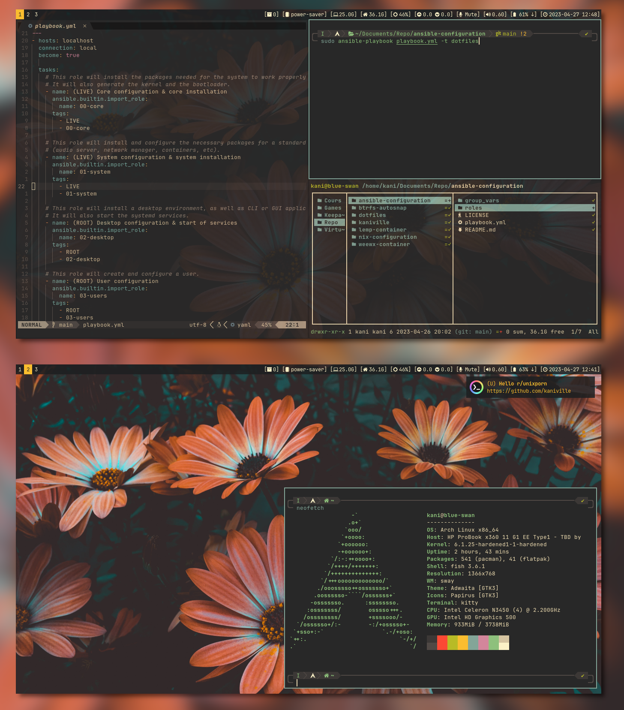

# Dotfiles 🐧

Configuration of tools that I use in my daily life.



## Details
Here are the tools that these dotfiles supply:

- `archlinux` as distribution
- `zsh` as shell
- `neovim` as editor
- `foot` as terminal
- `tmux` as terminal multiplexer
- `sway` as window manager
- `swaylock` as screen locker
- `fuzzel` as application launcher
- `grim`, `slurp` and `swappy` as screenshot utility
- `ranger` as file explorer
- `dunst` as notification daemon
- `xsettingsd` to provide settings to X11 applications

## Installation
To install these dotfiles, use https://github.com/kaniville/ansible-configuration.

You can also clone this repository with Git:
```
$ git clone https://github.com/kaniville/dotfiles.git
```
