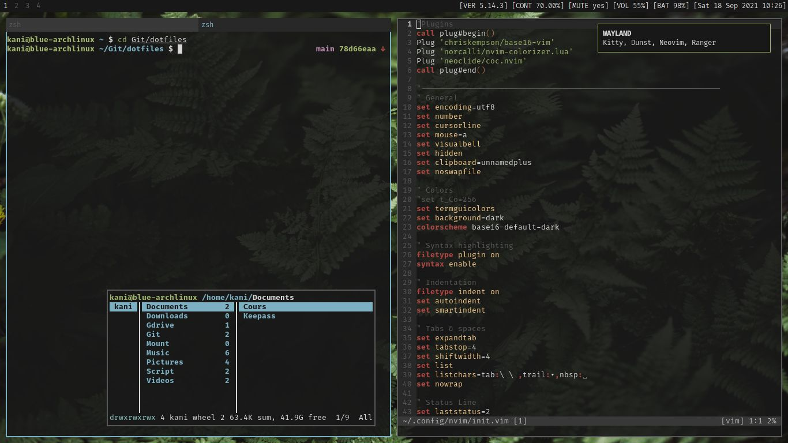

---
#### CLI
zsh / neovim / ranger / ufw / htop

#### Wayland
kitty / sway{bg,idle,lock} / dunst / bemenu

light / grim + slurp / gammastep / wl-clipboard

#### Other
tlp / atool / polkit-gnome / rclone / snapper / libappindicator-gtk3

---
#### Base
base / base-devel / linux-firmware / linux{-lts} / intel-ucode

#### Disks
ntfs-3g / exfat-utils / dosfstools / mtools / btrfs-progs

#### Archiving
zip / unzip / unrar / p7zip

#### Boot loader
os-prober / efibootmgr (uefi) / grub / grub-btrfs

#### Sound
pipewire{-pulse,-alsa,-jack}

#### Other
man-db / udisks2 / xdg-user-dirs / libmtp

---
#### Create a new user and add it to a group
```
# useradd -m -g GROUP USER
```

#### Add a user to a group
```
# usermod -a -G GROUP USER
```

#### Generate Grub config
```
# grub-mkconfig -o /boot/grub/grub.cfg
```

#### Enable os prober
Edit `/etc/default/grub` and add/uncomment:
```
GRUB_DISABLE_OS_PROBER=false
```
Then regenerate grub 2 config.

#### Mount BTRFS subvolumes
Useful for creating subvolumes:
```
# mount -o subvolid=0 /dev/sda3 /mnt
```

#### Launch Firefox with wayland
Use this environment variable (Add it to `/etc/environment` work well):
```
MOZ_ENABLE_WAYLAND=1
```

#### Setup firewall default
Enter these default rules for a personal computer with UFW:
```
# ufw default deny incoming
# ufw default allow outgoing
```

---
#### Packer.nvim
```
git clone --depth 1 https://github.com/wbthomason/packer.nvim\
~/.local/share/nvim/site/pack/packer/start/packer.nvim
```
