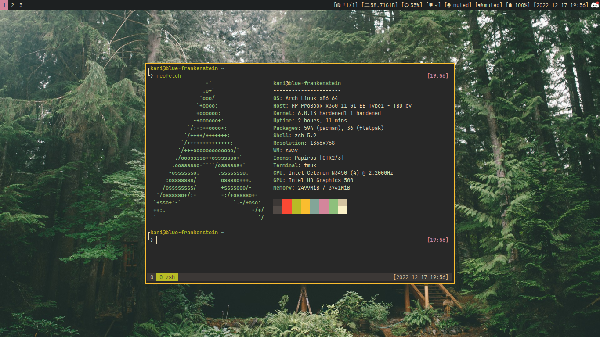

# Archlinux dotfiles 🐧

Configuration and tools that I use in my daily life.



## Installation
See https://wiki.archlinux.org/title/Installation_guide.

### Partitions
| Partition               | Mount Options                                   | Filesystem     | Mount Point         |
|-------------------------|-------------------------------------------------|----------------|---------------------|
| `/dev/sda1`             |`nodev,noexec,nosuid`                            | FAT-32         | `/boot`             |
| `/dev/sda2`             |                                                 | Swap           | [SWAP]              |
| `/dev/sda3`             |                                                 | Luks2          |                     |
| `/dev/mapper/luks_sda3` |`noatime,compress=zstd,subvol=@`                 | Btrfs          | `/`                 |
| `/dev/mapper/luks_sda3` |`noatime,compress=zstd,subvol=@home`             | Btrfs          | `/home`             |
| `/dev/mapper/luks_sda3` |`noatime,compress=zstd,subvol=@.snapshots`       | Btrfs          | `/.snapshots`       |
| `/dev/mapper/luks_sda3` |`noatime,compress=zstd,subvol=@var_log`          | Btrfs          | `/var/log`          |
| `/dev/mapper/luks_sda3` |`noatime,compress=zstd,subvol=@var_cache_pacman` | Btrfs          | `/var/cache/pacman` |

### Packages
#### Base
```
base base-devel linux-{firmware,hardened} intel-ucode btrfs-progs zip unzip unrar p7zip efibootmgr grub snapper
```

#### Fonts
```
ttf-jetbrains-mono-nerd noto-fonts noto-fonts-emoji ttf-liberation otf-ipafont
```

#### Services
```
udisks2 tlp bluez networkmanager pipewire{-alsa,-jack,-pulse} wireplumber apparmor nftables usbguard cups
```

#### Terminal
```
git android-tools zsh htop tmux neovim ranger task wl-clipboard
```

#### Desktop
```
foot sway{bg,idle,lock} dunst fuzzel grim slurp gammastep polkit-gnome gnome-keyring papirus-icon-theme
```

#### Applications
```
distrobox podman qemu-base swayimg mpv flatpak mupdf
```

#### Tools
```
libnotify xdg-{utils,user-dirs} python-i3ipc jq rclone alsa-utils man-db bluez-utils light wget ghostscript
```

## Configuration
### Kernel parameters
- `GRUB_CMDLINE_LINUX="lsm=landlock,lockdown,yama,apparmor,bpf lockdown=confidentiality cryptdevice=/dev/sda3:luks_sda3"`
```
lsm=landlock,lockdown,yama,apparmor,bpf
lockdown=confidentiality
cryptdevice=/dev/sda3:luks_sda3
```

- `echo kernel.unprivileged_userns_clone=1 > /etc/sysctl.d/unprivileged_userns_clone.conf`
```
kernel.unprivileged_userns_clone=1
```

### Systemd services
```
systemd-timesyncd systemd-resolved tlp bluetooth NetworkManager apparmor nftables cups
```

## Help
### Use Focusrite Scarlett
https://github.com/Focusrite-Scarlett-on-Linux/sound-usb-kernel-module

### Install "Ranger devicons"
```
git clone https://github.com/alexanderjeurissen/ranger_devicons \
~/.config/ranger/plugins/ranger_devicons
```

### Install "Packer.nvim"
```
git clone https://github.com/wbthomason/packer.nvim \
~/.local/share/nvim/site/pack/packer/start/packer.nvim
```
